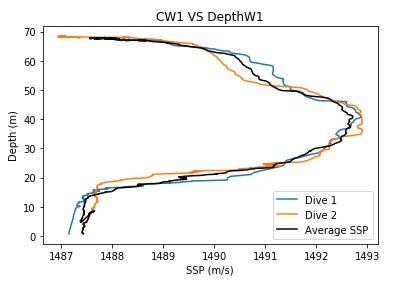

Jake Philpott

BME 450

1/29/2020

Project 1: CTD

Link to Jupyter Notebook on GitHub: https://github.com/jakep3/Project-1-CTD---Jake-Philpott/blob/master/Project_1_CTD_Assignment.ipynb

PROBLEM STATEMENT

  The following report will answer questions by outlining trends, and presenting data in forms of graphs and written responses, regarding various CTD devices in different locations for 24 hours of data. All of the data was collected from the Ocean Observatories Initiative (OOI) [1]. The following are the questions:
1.	“Find out how many dives exist per 24 hours and plot the speed of sound profile (ssp) for each dive. Also, in the same plot, calculate and plot the average ssp. Do this for both winter and summer, for each CTD device.”
2.	“Compare the number of dives per day of the shallow profiler vs deep profiler”. 
3.	“Where is the maximum value of ssp in each season? Explain why the max ssp should be there”? 
4.	Compare the ssp profile in day and night of all profilers, explain what you find (effects of day vs night)”. 
5.	“Compare the ssp profile in summer and winter of all profilers, explain what you find (effects of season)”. 
6.	“Compare the average ssp profiles of all profilers recorded at the same day in winter and summer (effects of location)”. 

BACKGROUND

  A CTD device is used to measure conductivity, temperature, and pressure in the seawater. The Ocean Observatories Initiative has many research devices that can be explored and whose data can be examined on their website. The CTD devices of interest for this report were:
1.	Coastal Endurance › Oregon Shelf Surface Piercing Profiler Mooring 
2.	Coastal Endurance › Oregon Offshore Cabled Shallow Profiler Mooring 
3.	Coastal Endurance › Oregon Offshore Cabled Deep Profiler Mooring 
4.	Cabled Array › Oregon Slope Base Shallow Profiler 
5.	Cabled Array › Oregon Slope Base Deep Profiler 
6.	Cabled Array › Axial Base Shallow Profiler 
7.	Cabled Array › Axial Base Deep Profiler 

CTD devices directly measure the conductivity, temperature, and pressure in seawater; however, they direct data can be used to calculate other values, such as depth and speed of sound. Depth is calculated using the equation depth = pressure*1000 / (density * gravitational acceleration) [SI units], and speed of sound is calculated using speed of sound = 1449.2 + 4.6T – 0.055T^2 +0.00029T^3 + (1.34-0.01T)*(S-35)+ 0.016Z [SI units] where T = temperature, S = salinity, and Z = depth. 

SOLUTION

  The solution to answer the list of questions began by visiting the OOI website and downloading 24 hours of data for the CTD profilers of interest. The data was then put onto GitHub in order to be able to be referenced in Jupyter Notebook. In Jupyter Notebook, all the data was able to be analyzed and used to obtain results. Calculations were performed using the depth and speed of sound equations that were listed in the Background section of this report. Calculating these two properties allowed for the SSP profile to be plotted for each of the CTD profilers. Obtaining these plots was the key to being able to answer all of the questions of interest. The plots allowed trends to be viewed and explained. 
Please refer to the link at the beginning of the paper to view the Jupyter Notebook if interested in the specific code that allowed for the derivation of the results.

RESULTS

  Results of the first question: The plots of depth (m) vs ssp (m/s) for each of the 7 CTD profilers are shown in Figures 1 – 14, and they all include the individual dives plotted along with the average SPP value for each dive. The number of dives were found using Jupyter Notebook by determining how many different start points the plotted data would have. The dive numbers all seemed reasonable and will help discuss patterns in further questions. The number of dives can be summarized in the Table 1 as follows:

Table 1: The number of dives in winter and summer for all of the profilers.

__Oregon Shelf Surface Piercing Profiler Mooring

Figure 1: Number of dives in the winter was 2. 
 

Figure 2: Number of dives in the summer was 3. 

__Cabled Shallow Profiler Mooring 
 

Figure 3: Number of dives in the winter was 13.
 

Figure 4: Number of dives in the summer was 18. 

__Oregon Offshore Cabled Deep Profiler Mooring 
 

Figure 5: Number of dives in the winter was 9. 
 

Figure 6: Number of dives in the summer was 4. 

__Oregon Slope Base Shallow Profiler 
 

Figure 7: Number of dives in the winter was 13. 
 

Figure 8: Number of dives in the summer was 13.

__Oregon Slope Base Deep Profiler 
 

Figure 9: Number of dives in the winter was 1.
  

Figure 10: Number of dives in the summer was 2.

__Axial Base Shallow Profiler 
 

Figure 11: Number of dives in the winter was 11.
 

Figure 12: Number of dives in the summer was 16.

__Axial Base Deep Profiler 
 

Figure 13: Number of dives in the winter was 5.
 

Figure 14: Number of dives in the summer was 3.
	
  The results to the second question were found by evaluating Figures 3 – 14. Evaluation involved comparing the number of dives for three pairs of profilers, each pair involving a shallow and deep profiler. The first pair is the Oregon Offshore Cabled Shallow Profiler and the Oregon Offshore Cabled Deep Profiler; the second pair is the Oregon Slope Base Shallow Profiler and Oregon Slope Base Deep Profiler; and the third pair is the Axial Base Shallow Profiler and the Axial Base Deep Profiler. 
For the first pair for 24 hours of data; the shallow profiler had 13 dives in the winter and 18 dives in the summer, and the deep profiler had 9 dives in the winter and 4 dives in the summer. 
For the second pair for 24 hours of data; the shallow profiler had 13 dives in the winter and 13 dives in the summer, and the deep profiler had 1 dive in the winter and 2 dives in the summer.
For the third pair for 24 hours of data; the shallow profiler had 11 dives in the winter and 16 dives in the summer, and the deep profiler had 5 dives in the winter and 3 dives in the summer. For each of the three pairs, they all had more dives for their respective shallow profiler in the 24 hour period. This makes sense because it takes longer to complete a dive for a deep profiler, since it has more distance to cover. The short profilers do not travel as far and can therefore make more trips from their location to the surface. 
	
  The results were found for the third question by the use of Jupyter Notebook. Jupyter Notebook was used in order to break down the profiler data into different dive arrays, and then for each profiler, it was then possible to find the location of the maximum SSP value by looking at the SSP profile plots (Figures 1-14) to see approximately the depth they are at. Table 2 complies the data explained above:
 

Table 2: Estimate of depth of SSP maximum values for winter and summer.

As can be seen, the maximum value of ssp in each season is at a greater depth during the winter, as opposed to the summer, excluding the Oregon Slope Base Deep Profiler and the Axial Base Deep Profiler where there was not significant change between seasons. This makes sense because the ssp maximum value will be at a shallower depth during the summer (for profilers that do not go below 1000m) because the surface layer of the water is an increased temperature. As shown by the equation for speed of sound; C = 1449.2 + 4.6T – 0.055T^2 +0.00029T^3 + (1.34-0.01T)*(S-35)+ 0.016Z,  temperature is a significant factor on what the speed of sound will be, and thus greater temperature results in greater speed of sound through that layer of water.
	
  Results to the fourth question were found by analyzing Figures 1 – 14 and having an understanding on temperature change between day and night. It is understood that during the day, the surface layer of the ocean will increase in temperature, and then during the night the surface layer of the ocean will decrease in temperature. When the temperature increases, the ssp will be a larger value, while when the temperature decreases the ssp will be a smaller value. Using this method to evaluate the figures, the deep profilers did not show much of an effect for day vs night, but the shallow profilers did. The deep profilers recorded speed of sound that did not vary significantly. Once at the 1000m level, there is hardly any change in speed of sound profile for night and day, which is because the temperature remains more constant. For the shallow profilers, a large shift in the ssp profile can be seen when comparing day and night. This is because the water near the surface become a higher temperature during the day, which results in a higher ssp values during the day; as opposed to the night time, where the surface temperature declines and so does the ssp value. The surface and shallow depths are more prone to temperature change and will not have constant temperature values like to larger depths. 
	
  For the results of question five; similarly to question 4, Figures 1-14 were analyzed and the deep profilers, at depths of more than 1000m, did not show substantial variation due to seasons. However, the shallow profilers did show variation. During the winter, the shallow profilers recorded the maximum ssp values at lower depths than during the summer. Also, during the winter, there was not much change in ssp at the surface level, while during the summer, there was large variation, up to 30m/s, at the surface level. 

  Results to the sixth question were obtained by evaluating Figures 1-14, and also by using Figure 15. On Figures 1-14, the average ssp values were plotted on each of the plots for their respective profiler. If simply evaluating these, then it will be very similar to the results of question five, where there is an effect on season. However, since the interest for this question is effect of location, Figure 15 is used. From viewing the location of the Coastal Endurance Array and the Cabled Array on the OOI website, it appears that the Coastal Endurance Array is located at latitude 44N to 45N and the Cabled Array is located at latitude 44N to 46N. This change is not significant enough to be able to establish location change for the observed average ssp values of the profilers. However, there is in fact effect of location on the ssp profile. Assuming that it is the same day, the same season, and the same longitude, the profile will change in the following way: at the equator, the speed of sound will be a greater value at the surface and decrease until about 1000m where it will begin to increase again (this increase after 1000m occurs always because of the constant temperature at the greater depths). As the latitude increase, in the north or south direction, away from the equator, the speed of sound near the surface will begin to decrease. The decrease in speed of sound is what affects the ssp profile, and this is once again due to the shallow/surface layer of water temperature change. The temperature of the surface of the water at the equator is on average the highest temperature, which makes sense for it to have the highest speed of sound. Further north and south of the equator, the temperature at those depths begin to decrease, resulting in the lower speed of sound. 

Figure 15: The Depth Vs Speed of sound for different latitudes, at a constant longitude. 
At equator, warm water at surface. Far from equator, cold water at surface.

CONCLUSIONS
	
  The purpose of this report was to be able to provide the answers to various questions regarding trends and relations that can be understood from viewing the data provided from CTD profiles in the ocean. The data is available for everyone to see on the OOI website. There are many ways to evaluate the data, and using Jupyter Notebook is an effective way to sort through the thousands of collected data points. To recap on the results to the questions: The deep profilers will have less dives in 24 hours than shallow profilers, the maximum value of ssp is effected by season for shallow depths (less than 1000m) and the maximum value will be located closer to the surface during the summer when the water temperature is warmer, the ssp profile will change significantly during the day and night for shallow profilers but not for the deep profilers, latitude location changes the ssp profile, by having the greatest ssp near the surface when latitude is at the equator, and ssp decreases as latitude increases (both north and south). The key take away is that temperature plays the largest role in the ssp profile. As explained in the results section, temperature is influential in the calculation of the speed of sound, so it is fitting that the ssp profile changes significantly when temperature changes significantly. 
  
REFERENCES

[1] 	"Ocean Observatories Initiative," [Online]. Available: https://oceanobservatories.org/. [Accessed January 29 2020]
